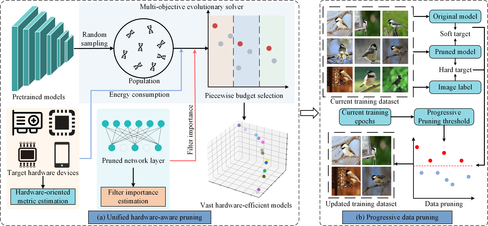
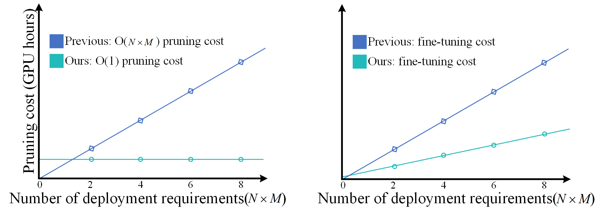

# All-in-one hardware-oriented compression for efficient multi-hardware deployment

## Framework
<p align="center">

</p>


## Usage
### Requirements

* Python3
* pytorch 1.11.0
* thop

### Prepare Data
DownLoad the ImageNet-1k dataset

### Generate Feature Maps.

```shell
python calculate_feature_maps.py \
--arch resnet_50 \
--dataset imagenet \
--data_dir ./data/imagenet \
--pretrain_dir ./resnet50.pth \
--gpu 0
```

### Calculate Feature Distribution Discrepancy (FDD).

This procedure is time-consuming, please be patient.

```shell
python calculate_FFD.py \
--arch resnet_50 \
--repeat 5 \
--num_layers 53
```

### Fine-tune Models.

```shell
CUDA_VISIBLE_DEVICES=0 python main.py \
--data_dir /data1/wanghx/dataset/ImageNet/ \
--data_set ImageNet-few \
--result_dir ./result/resnet_50/ResNet10G_10h2 \
--arch resnet_50 \
--batch_size 512 \
--epochs 90 \
--lr-scheduler cosineannealinglr \
--lr-warmup-epochs 0 \
--lr-warmup-method linear \
--train-crop-size 224 \
--val-resize-size 232 \
--learning_rate 0.01 \
--momentum 0.9 \
--weight_decay 0.00002 \
--milestones 30 60 80 \
--num_sample 200000 \
--pretrain_dir ./Pruned_resnet_50/pruned_resnet_10G_2.pth \
--lr_min 5e-4 
```


## Pruning Results


#### Algorithm costs
<p align="center">

</p>

Our method incurs a constant pruning cost, while previous works exhibit a linear increase in pruning cost with both the number of budgets and hardware devices.

#### ImageNet 
| Model  | Inference  latency (FPS) | Top-1 Accuracy | Top-5 Accuracy |                                            Checkpoints                                             |
|:----------------------:|:------------------------:|:--------------:|:--------------:|:--------------------------------------------------------------------------------------------------:|
|       ResNet-50        |           1523           |     76.2%      |     92.9%      | [Download](https://drive.google.com/file/d/1RS_NYU7W__V2NDUkkp5Mf3xckxLXOdav/view?usp=drive_link)  |
|       ResNet-50        |           2506           |     76.1%      |     92.8%      |                                                                                                    | 
|       ResNet-50        |           3408           |     74.7%      |     92.1%      |   [Download](https://drive.google.com/file/d/1uVEfOuHtpcorzjnkmNEEnOh8PTwUocF6/view?usp=sharing)   |
|      MobileNet-V1      |           5358           |     71.1%      |     89.8%      | [Download](https://drive.google.com/file/d/1P0RQUMr_4bP6MYq2V2V7MgJRRxzKc0Ri/view?usp=drive_link)  | 
|      MobileNet-V1      |           7496           |     70.6%      |     89.4%      |   [Download](https://drive.google.com/file/d/132zQPBjNqknsLO3rXkzwidCtd83GJnQt/view?usp=sharing)   | 
|      MobileNet-V1      |          10188           |     67.8%      |     86.8%      |                                                                                                    | 
|      MobileNet-V2      |           4225           |     72.1%      |     90.8%      | [Download](https://drive.google.com/file/d/1oTY0-i1ZoOJZctoR6zwh47HXeR3Fc6dH/view?usp=drive_link)  | 
|      MobileNet-V2      |           5492           |     71.2%      |     90.1%      |   [Download](https://drive.google.com/file/d/1wBOFfg52iPFPvis33raf5GeLdne8fyCn/view?usp=sharing)   | 

#### CIFAR-10
| Model  |   Acceleration ratio    | Top-1 Accuracy |                                            Checkpoints                                             |
|:----------------------:|:-----------------------:|:--------------:|:--------------------------------------------------------------------------------------------------:|
|         VGG-16         |           1x            |     93.7%      | [Download](https://drive.google.com/file/d/1AeEJrZ5fQJIN0Fr3ROrsFdy8OwWxhNis/view?usp=drive_link)  |   
|         VGG-16         |          1.47x          |     93.8%      | [Download](https://drive.google.com/file/d/1pe4ysk4JCwItD0ln4jIdJu43MplBYFhd/view?usp=drive_link)  |   
|         VGG-16         |          1.52x          |     93.7%      | [Download]( https://drive.google.com/file/d/1wToisbyjfrOb6Xl3FAdgO-xWbdXP_FIH/view?usp=drive_link) |  
|       ResNet-56        |           1x            |     93.3%      | [Download](https://drive.google.com/file/d/1cO36jeV73Gy0UEiFxzcNU05_8AmJY_FZ/view?usp=drive_link)  |  
|       ResNet-56        |          1.16x          |     93.6%      | [Download](https://drive.google.com/file/d/1TOzdts02PrMMyMWw4hreceFGvpBIQnpo/view?usp=drive_link)  |  
|       ResNet-56        |          1.20x          |     92.8%      |   [Download](https://drive.google.com/file/d/12B_j_2FAzwjj_z2a9Qyxn9hMf-fNPmx3/view?usp=sharing)   |   


## Others

Since I rearranged my original codes for simplicity, please feel free to open an issue if something wrong happens when you run the codes. (Please forgive me for the late response and wait for me to respond to your problems in several days.)

